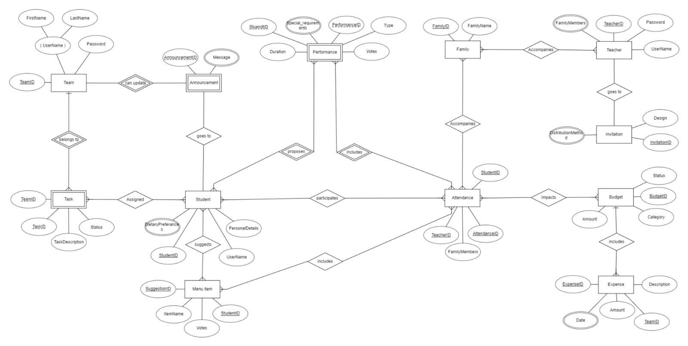

# Welcome Party Management System

This repository contains the backend for a university welcome party management system. It provides RESTful API endpoints for user registration, login, menu and performance suggestions, voting, attendance tracking, and event management.

## Features

- Student, Teacher, and Admin registration and login
- Menu and performance suggestions with voting
- Attendance tracking
- Theme proposals
- Family member management
- Task, Budget, and Invitation management

## Project Structure

```
DDL.sql
index.js
Diagram/
    ERD.jpg
```

- **DDL.sql**: SQL script to set up the database schema and initial data.
- **index.js**: Node.js Express server handling API endpoints and database operations.
- **Diagram/ERD.jpg**: Entity Relationship Diagram for the database.

## Getting Started

### Prerequisites

- Node.js
- MySQL

### Setup

1. **Clone the repository**

2. **Set up the database**
   - Import `DDL.sql` into your MySQL server
   - Update MySQL credentials in [`index.js`](index.js) if needed.

3. **Run the server**
   ```sh
   node index.js
   ```
   The server will start at [http://localhost:8080](http://localhost:8080).

## API Endpoints

- `/adminlogin` - Admin login
- `/studentlogin` - Student login
- `/studentregister` - Student registration
- `/teacherlogin` - Teacher login
- `/teacherregistration` - Teacher registration
- `/submitSuggestion` - Submit menu suggestion
- `/suggestedMenus` - Get suggested menus
- `/vote` - Vote for a menu
- `/submitPerformance` - Submit performance proposal
- `/suggestedPerformances` - Get suggested performances
- `/p_vote` - Vote for a performance
- `/attendance` - Get attendance statistics
- `/themesdisplay` - Display themes
- `/highestVotedSuggestion` - Get highest voted menu suggestion
- `/highestVotedPerformance` - Get highest voted performance

## Database Schema


